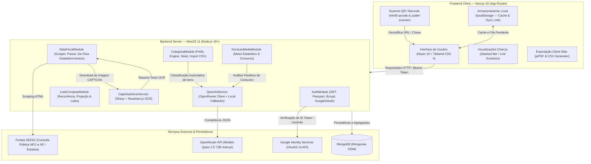
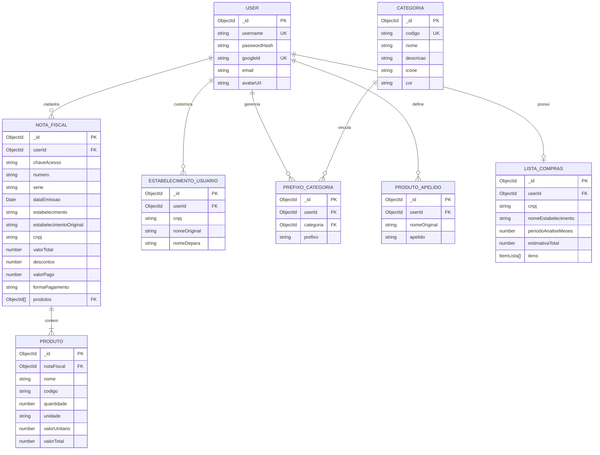

# Documento de Engenharia Reversa e Análise de Requisitos
## Sistema: De Olho na Nota (Plataforma de Gestão de Gastos e Inteligência de Consumo via NFC-e)

---

## Sumário Executivo

O **De Olho na Nota** é uma solução completa de controle financeiro pessoal, inteligência de consumo e automação doméstica desenvolvida com foco na digitalização ágil de cupons fiscais (**NFC-e** - Nota Fiscal de Consumidor Eletrônica).

A aplicação opera através de dois repositórios complementares:
1. **Backend (`de-olho-na-nota`)**: Uma API REST modular desenvolvida em **NestJS** e **MongoDB (Mongoose)**, responsável pelo processamento assíncrono de notas fiscais, web scraping de portais estaduais da SEFAZ, quebra automatizada de CAPTCHA via OCR/Visão Computacional, categorização inteligente com LLM (**Qwen 2.5 72B via OpenRouter**) e algoritmos determinísticos de consumo e lista de compras.
2. **Frontend (`de-olho-na-nota-web`)**: Uma aplicação web moderna e responsiva construída em **Next.js 16 (App Router)** e **Tailwind CSS v4**, dotada de leitor de QR Code/Código de Barras em tempo real, dashboards analíticos com gráficos empilhados e de evolução temporal, gestão de apelidos (de-para), visualização interativa em estilo caderno de notas e exportação de relatórios em PDF e CSV.

---

## 1. Escopo Atual (In Scope) e Arquitetura Tecnológica Identificada

### 1.1 Escopo Atual do Sistema (In Scope)

| Módulo Funcional | Funcionalidades em Escopo |
| :--- | :--- |
| **Autenticação & Contas** | Cadastro e login local com hash seguro (`bcrypt`); Autenticação federada com Google OAuth 2.0 (Google Identity Services); Vinculação e desvinculação de conta Google a perfis existentes; Gestão de perfil (atualização de username, troca de senha); Gerenciamento de sessão com JWT e política de retenção (*Remember Me* de 1 ou 7 dias). |
| **Ingestão de NFC-e** | Leitura contínua de QR Code via câmera de dispositivo (mobile/desktop); Leitura de imagens locais contendo QR Code; Inserção manual de link oficial da NFC-e; Leitura e consulta por Chave de Acesso (44 dígitos numéricos) integrada ao portal da SEFAZ-SP com resolução automatizada de CAPTCHAs gráficos. |
| **Parsing & Extração Fiscal** | Web scraping com engine Cheerio sobre o HTML da SEFAZ; Higienização e normalização de descrições de produtos (remoção de ruídos de layout como siglas de UF no início e unidades no fim); Extração de dados da nota (emissão, chave, série, número, valor bruto, descontos, valor pago, forma de pagamento, CNPJ e razão social) e dos itens individuais. |
| **Estabelecimentos & De-Para** | Listagem agregada de todos os estabelecimentos frequentados pelo usuário (baseado no CNPJ); Cadastro de apelido amigável (*De-Para*) por usuário, substituindo o nome fantasia/razão social em todas as notas fiscais e relatórios sem perda do registro original. |
| **Categorização & Prefixos** | 12 categorias canônicas do varejo pré-configuradas no banco de dados; Mapeamento de produtos por prefixos de texto ordenados por especificidade (*longest prefix match*); CRUD completo de prefixos por usuário; Importação em lote via CSV com validação sintática e semântica; Auto-classificação inteligente via IA generativa (**Qwen 2.5 72B**) com fallback algorítmico local. |
| **Painel de Produtos & Preços** | Visualização consolidada de produtos agrupados por nome; Algoritmo de correspondência fonética/aproximada (*Fuzzy Matching* com distância de Levenshtein e verificação de prefixos em 60%); Gráficos históricos de evolução de preços unitários; Comparativo de preços praticados entre estabelecimentos distintos; Exportação de inventário e compras para formatos CSV e PDF com tabelas estilizadas. |
| **Dashboard Financeiro** | Consolidação mensal e agregação cronológica de despesas; Distribuição de gastos por semana do mês agrupados por categoria através de gráficos de barras empilhadas (*Stacked Bar Chart*); Apuração de indicadores-chave (KPIs): Total mensal, média semanal de gastos e ranking das categorias de maior impacto. |
| **Duração Média de Consumo** | Filtro multidimensional por categoria e janela temporal; Modo de cálculo determinístico baseado em intervalos reais entre compras recorrentes; Modo de cálculo analítico baseado em IA (**Qwen 2.5**) calculando taxa de consumo diário, projeção de esgotamento e nível de confiabilidade da amostragem. |
| **Lista de Compras Inteligente** | Identificação automática de estabelecimentos elegíveis; Detecção de produtos recorrentes (comprados em no mínimo 2 meses distintos na janela configurada de 1 a 6 meses); Sugestão de quantidade média ponderada arredondada para cima (`Math.ceil`); Projeção de custo estimado usando o preço unitário da compra mais recente; Sistema De-Para de apelidos para produtos codificados; Interface interativa com metáfora de caderno escolar e fonte manuscrita; Mecanismo de persistência com auto-save em lote (a cada 10 ações) e sincronização offline com `localStorage`. |
| **Customização & UX** | Tour interativo guiado passo a passo (*Joyride*); Personalização de paleta temática de cores do perfil por sessão com propagação em botões e gráficos; Seletor dinâmico de papéis de parede/planos de fundo temáticos com persistência local. |

---

### 1.2 Fora de Escopo / Não Suportado no Momento (Out of Scope)

1. **Emissão ou Envio de Documentos Fiscais**: O sistema opera exclusivamente em modo leitura e inteligência analítica de notas fiscais já autorizadas e emitidas pela SEFAZ.
2. **Integração Financeira Direta / Open Finance**: O sistema não se conecta a contas bancárias ou cartões de crédito; todas as informações financeiras são derivadas das notas fiscais ingeridas.
3. **Contas Compartilhadas / Multi-tenant Familiar**: Cada conta e conjunto de notas fiscais, prefixos e listas de compras pertencem isoladamente a um único `userId`.
4. **Universalidade Irrestrita de Portais SEFAZ**: A consulta de chave de acesso com resolução de CAPTCHA está implementada especificamente para o padrão SEFAZ-SP (com suporte estrutural para URLs padrão NFC-e SP, RS e SC no processamento direto por link).

---

### 1.3 Arquitetura Tecnológica e Engenharia do Workspace

#### Detalhamento dos Componentes Tecnológicos

1. **Camada de Apresentação (Frontend)**:
   - **Next.js 16 / React 19**: Arquitetura modular baseada no diretório `app/(main)`, assegurando renderização dinâmica protegida pelo componente centralizador `AuthGate`.
   - **Tailwind CSS 4**: Estilização atômica combinada com variáveis CSS customizadas injetadas pelo `SessionThemeProvider` (`--user-color-primary`, `--user-color-secondary`).
   - **Chart.js 4 & react-chartjs-2**: Renderização acelerada em Canvas de barras empilhadas e curvas de evolução temporal com interpolação suave de preenchimento (`Filler`).
   - **Geração de Documentos**: `jspdf` e `jspdf-autotable` para geração de relatórios tabulares em formato vetorial PDF de alta definição diretamente no navegador.

2. **Camada de Aplicação e Serviços (Backend)**:
   - **NestJS 11**: Estrutura orientada a serviços com injeção de dependência e ciclo de vida controlado (`OnModuleInit`).
   - **Validação e Transformação**: `ValidationPipe` global ativado com `whitelist: true`, `forbidNonWhitelisted: true` e `transform: true`, garantindo integridade e bloqueio de atributos indesejados (*Payload Pollution*).
   - **Segurança da Sessão**: `JwtModule` assinando payloads simétricos contendo `{ sub: userId, username }`, validados via `JwtAuthGuard` em nível de rota e decorador customizado `@UserId()`.

3. **Engenharia de Web Scraping e Visão Computacional**:
   - **Processamento de Requisições**: Cliente `axios` com impersonação de *User-Agent* de navegadores desktop e gestão manual de cookies de sessão ASP.NET (`ASP.NET_SessionId`).
   - **Pré-processamento Gráfico (`sharp`)**: Tratamento de ruídos do CAPTCHA em memória RAM (`Buffer`): conversão para escala de cinza (`grayscale`), redimensionamento proporcional 3x via algoritmo de interpolação `lanczos3`, expansão dinâmica de contraste (`normalize`), aumento de nitidez das bordas (`sharpen { sigma: 2 }`) e duplo corte de limiarização binária (`threshold`).
   - **Reconhecimento Óptico de Caracteres (`tesseract.js`)**: Worker Tesseract inicializado dinamicamente em modo *Single Text Line* (`PSM 7`) com restrição estrita de vocabulário aos caracteres `[A-Za-z0-9]`.

4. **Integração com Inteligência Artificial Generativa**:
   - **Orquestrador LLM**: Comunicação REST assíncrona com **Qwen 2.5 72B Instruct** via OpenRouter com controle de timeout de 25 segundos e temperatura reduzida ($0.1$ a $0.2$) para respostas previsíveis e estruturadas em JSON estrito.
   - **Resiliência Heurística**: Implementação de *Fallback Local* em ambos os motores de IA. Caso ocorra erro de rede, timeout ou ausência de chave de API, a camada de negócio executa algoritmos determinísticos locais baseados em dicionários de expressões regulares e médias estatísticas sem falhar a requisição do usuário.

---

## 2. Requisitos Funcionais (RF)

### 2.1 Módulo: Autenticação, Identidade e Sessão

| ID | Requisito Funcional | Tela / Rota Frontend | Endpoint / Rota Backend | Método | Descrição da Operação |
| :--- | :--- | :--- | :--- | :---: | :--- |
| **RF-001** | Registro de Usuário Local | `/login` (`LoginGlass.tsx`) | `/auth/register` | `POST` | Cria uma nova conta com `username` (normalizado para minúsculas) e `password` encriptada com hash de 10 rounds de salt. Bloqueia duplicidade. |
| **RF-002** | Login Local com Credenciais | `/login` (`LoginGlass.tsx`) | `/auth/login` | `POST` | Autentica usuário e senha. Gera token JWT com validade estendida de 7 dias caso `remember=true` ou 1 dia caso `remember=false`. |
| **RF-003** | Autenticação Federada Google | `/login` (`LoginGlass.tsx`) | `/auth/google` | `POST` | Valida o token do Google (via `verifyIdToken` ou endpoint `userinfo`), localiza usuário por `googleId` ou e-mail, realiza cadastro automático se inexistente e retorna token JWT de sessão. |
| **RF-004** | Obtenção do Perfil Autenticado | `/perfil` (`perfil/page.tsx`) | `/auth/me` | `GET` | Retorna os detalhes cadastrais do usuário logado (`id`, `username`, `email`, `avatarUrl`, `googleId`), indicando se possui senha e Google vinculado. |
| **RF-005** | Atualização do Nome de Usuário | `/perfil` (`perfil/page.tsx`) | `/auth/me` | `PATCH` | Permite a troca do `username`, validando disponibilidade do novo identificador e atualizando o `localStorage` do cliente. |
| **RF-006** | Alteração de Senha Local | `/perfil` (`perfil/page.tsx`) | `/auth/change-password` | `POST` | Requer a senha atual correta e substitui pelo novo hash da nova senha (mínimo de 6 caracteres). |
| **RF-007** | Vinculação de Conta Google | `/perfil` (`perfil/page.tsx`) | `/auth/link-google` | `POST` | Associa um `googleId` validado e foto de perfil à conta atual do usuário autenticado no sistema. |
| **RF-008** | Desvinculação de Conta Google | `/perfil` (`perfil/page.tsx`) | `/auth/unlink-google` | `POST` | Remove o vínculo da conta Google do perfil. Valida se o usuário possui senha local cadastrada antes de desvincular. |

---

### 2.2 Módulo: Ingestão, Captura e Extração de Notas Fiscais

| ID | Requisito Funcional | Tela / Rota Frontend | Endpoint / Rota Backend | Método | Descrição da Operação |
| :--- | :--- | :--- | :--- | :---: | :--- |
| **RF-009** | Escaneamento de Cupom via Câmera | `/` (`EscanearCupom.tsx`) | `/notas-fiscais/processar` | `POST` | Aciona a webcam ou câmera móvel para leitura ao vivo do QR Code impresso no cupom e submete a URL para extração. |
| **RF-010** | Leitura de Imagem do Cupom | `/` (`EscanearCupom.tsx`) | `/notas-fiscais/processar` | `POST` | Permite o upload de arquivos de imagem locais contendo o QR Code do cupom, decodificando o texto via `html5-qrcode` e processando. |
| **RF-011** | Inserção Manual de Link NFC-e | `/` (`EscanearCupom.tsx`) | `/notas-fiscais/processar` | `POST` | Recebe a URL da consulta pública da nota digitada ou colada pelo usuário e efetua requisição HTTP com parsing de DOM via Cheerio. |
| **RF-012** | Consulta Pública por Chave de Acesso | `/` (`EscanearCupom.tsx`) | `/notas-fiscais/processar-chave` | `POST` | Recebe a chave de 44 dígitos, acessa a SEFAZ-SP, obtém tokens de sessão ASP.NET, baixa e soluciona o CAPTCHA via OCR e extrai os itens da nota. |
| **RF-013** | Retry e Tolerância a Falha de CAPTCHA | N/A (Execução Backend) | `/notas-fiscais/processar-chave` | `POST` | Em caso de OCR impreciso ou rejeição do código pelo servidor da fazenda, repete o ciclo de recuperação de imagem e OCR por até 3 vezes. |
| **RF-014** | Prevenção de Duplicidade de Notas | `/` (`EscanearCupom.tsx`) | `/notas-fiscais/processar*` | `POST` | Bloqueia a inserção da mesma nota fiscal para o mesmo usuário através do índice composto único `{ chaveAcesso: 1, userId: 1 }`. |

---

### 2.3 Módulo: Gestão de Notas, Produtos e Estabelecimentos

| ID | Requisito Funcional | Tela / Rota Frontend | Endpoint / Rota Backend | Método | Descrição da Operação |
| :--- | :--- | :--- | :--- | :---: | :--- |
| **RF-015** | Listagem Histórica de Notas | `/notasfiscais` (`NotasFiscais.tsx`) | `/notas-fiscais` | `GET` | Retorna todas as notas fiscais cadastradas pelo usuário logado com seus respectivos produtos populados. |
| **RF-016** | Detalhamento de Nota por Identificador | `/notasfiscais` (`NotasFiscais.tsx`) | `/notas-fiscais/:id` | `GET` | Obtém o documento fiscal completo com itens, valores de desconto, tributação e dados do emitente para o usuário autenticado. |
| **RF-017** | Agrupamento de Gastos por Mês | `/notasfiscais` (`NotasFiscais.tsx`) | N/A (Agregação Client) | N/A | Totaliza valores pagos organizados por competência cronológica (`Mês/Ano`) e permite filtrar as notas daquele período. |
| **RF-018** | Catálogo Consolidado de Produtos | `/produtos` (`Produtos.tsx`) | `/notas-fiscais` | `GET` | Agrupa todas as compras do usuário pelo nome do produto, aplicando fuzzy matching e calculando quantidade total, valor total e preço médio. |
| **RF-019** | Histórico e Evolução de Preços | `/produtos` (`Produtos.tsx`) | N/A (Agregação Client) | N/A | Exibe gráfico em linha demonstrando a oscilação do preço unitário de determinado produto ao longo dos meses e compras. |
| **RF-020** | Comparativo de Preços entre Mercados | `/produtos` (`Produtos.tsx`) | N/A (Agregação Client) | N/A | Exibe tabela discriminando onde determinado item foi adquirido, data da última compra e valor praticado por cada CNPJ/estabelecimento. |
| **RF-021** | Exportação de Inventário em PDF/CSV | `/produtos` (`Produtos.tsx`) | N/A (Geração Client-Side) | N/A | Gera arquivos estruturados contendo a relação de produtos, preços médios e histórico de compras para download em planilha ou documento PDF. |
| **RF-022** | Listagem de Estabelecimentos | `/configuracoes` (`Estabelecimentos.tsx`) | `/notas-fiscais/estabelecimentos` | `GET` | Agrupa notas por CNPJ e exibe a razão social original da SEFAZ, o apelido De-Para cadastrado e o volume total de notas vinculadas. |
| **RF-023** | Configuração de De-Para de Estabelecimento | `/configuracoes` (`Estabelecimentos.tsx`) | `/notas-fiscais/estabelecimentos/:cnpj` | `PATCH` | Cria ou atualiza o nome amigável de um CNPJ para o usuário e atualiza em cascata o campo `estabelecimento` em todas as suas notas fiscais. |

---

### 2.4 Módulo: Categorização, Prefixos e Classificação por IA

| ID | Requisito Funcional | Tela / Rota Frontend | Endpoint / Rota Backend | Método | Descrição da Operação |
| :--- | :--- | :--- | :--- | :---: | :--- |
| **RF-024** | Listagem das Categorias Canônicas | `/categorias` (`Categorias.tsx`) | `/categorias` | `GET` | Retorna as 12 categorias pré-populadas pelo seed da aplicação (código, nome, cor, ícone Lucide e descrição). |
| **RF-025** | Gestão de Prefixos de Usuário (CRUD) | `/categorias` (`Categorias.tsx`) | `/categorias/prefixos*` | `GET/POST/PUT/DELETE` | Permite criar, editar, excluir e consultar prefixos textuais (em maiúsculas) atrelados às categorias padrão para a conta do usuário. |
| **RF-026** | Classificação Automática por Longest Match | `/produtos`, `/financeiro` | N/A (Lógica de Negócio) | N/A | Atribui categoria a um produto com base no prefixo mais longo coincidente (`starts_with`), garantindo especificidade (ex: "LEITE CONDENSADO" sobrepõe "LEITE"). |
| **RF-027** | Importação de Prefixos via CSV | `/categorias` (`Categorias.tsx`) | `/categorias/prefixos/importar` | `POST` | Recebe arquivo CSV (`prefixo,codigo_categoria`), valida regras e linhas duplicadas, e insere novos prefixos em lote. |
| **RF-028** | Auto-Classificação de Nota via IA | `/notasfiscais` (`NotasFiscais.tsx`) | `/categorias/classificar-ia` | `POST` | Identifica produtos de uma nota fiscal que ainda não possuem prefixo e invoca o Qwen 2.5 72B para gerar novos prefixos e salvá-los no banco. |
| **RF-029** | Modal de Pesquisa Reversa de Prefixos | `/categorias` (`ModalPesquisaProdutosNota.tsx`) | `/notas-fiscais` | `GET` | Permite ao usuário testar um prefixo contra todo o histórico de produtos de suas notas fiscais antes de salvar a regra. |

---

### 2.5 Módulo: Dashboard Financeiro e Análise de Gastos

| ID | Requisito Funcional | Tela / Rota Frontend | Endpoint / Rota Backend | Método | Descrição da Operação |
| :--- | :--- | :--- | :--- | :---: | :--- |
| **RF-030** | Seletor Temporal de Competência | `/financeiro` (`DashboardFinanceiro.tsx`) | N/A (Agregação Client) | N/A | Apresenta dropdown com todos os meses que possuem notas fiscais cadastradas para filtragem instantânea do painel. |
| **RF-031** | Gráfico de Gastos por Semana e Categoria | `/financeiro` (`DashboardFinanceiro.tsx`) | N/A (Chart.js Stacked Bar) | N/A | Calcula a semana do mês para cada nota fiscal e desenha barras empilhadas exibindo o dispêndio semanal discriminado por cor de categoria. |
| **RF-032** | Apuração de KPIs Financeiros | `/financeiro` (`DashboardFinanceiro.tsx`) | N/A (Cálculo Client) | N/A | Apresenta cards contendo: Valor total investido no mês, estimativa de gasto médio semanal e volume de notas apuradas. |
| **RF-033** | Ranking de Categorias por Impacto | `/financeiro` (`DashboardFinanceiro.tsx`) | N/A (Ordenação Client) | N/A | Ordena as categorias de forma decrescente pelo montante gasto no mês com badges numéricos formatados em Real (BRL). |

---

### 2.6 Módulo: Duração Média e Previsão de Consumo

| ID | Requisito Funcional | Tela / Rota Frontend | Endpoint / Rota Backend | Método | Descrição da Operação |
| :--- | :--- | :--- | :--- | :---: | :--- |
| **RF-034** | Filtragem de Produtos por Categoria e Janela | `/financeiro` (`DuracaoMedia.tsx`) | `/duracao-media/filtrar` | `POST` | Localiza todas as notas e produtos dentro de um intervalo de meses (`mesInicial` e `qtdMeses`) que casem com a categoria especificada. |
| **RF-035** | Cálculo Determinístico de Duração | `/financeiro` (`DuracaoMedia.tsx`) | `/duracao-media/calcular` | `POST` | Ordena as datas de compra dos produtos selecionados, calcula a diferença em dias entre cada compra consecutiva e extrai a média aritmética. |
| **RF-036** | Cálculo com IA e Projeção de Estoque | `/financeiro` (`DuracaoMedia.tsx`) | `/duracao-media/calcular-ia` | `POST` | Submete série temporal e volumes ao Qwen 2.5, retornando taxa diária de consumo, data projetada de esgotamento e confiança estatística. |
| **RF-037** | Comparativo Direto entre Dois Produtos | `/notasfiscais` (`NotasFiscais.tsx`) | `/notas-fiscais/produtos/comparar-duracao` | `GET` | Recebe dois nomes de produtos e compara o intervalo médio de reposição e número total de compras de cada um. |

---

### 2.7 Módulo: Lista de Compras Inteligente

| ID | Requisito Funcional | Tela / Rota Frontend | Endpoint / Rota Backend | Método | Descrição da Operação |
| :--- | :--- | :--- | :--- | :---: | :--- |
| **RF-038** | Consulta de Mercados Elegíveis | `/lista-compras` (`ListaCompras.tsx`) | `/lista-compras/mercados` | `GET` | Lista estabelecimentos onde o usuário comprou, apresentando nome original/De-Para, total de notas e contagem de meses com histórico. |
| **RF-039** | Geração da Lista Baseada em Recorrência | `/lista-compras` (`ListaCompras.tsx`) | `/lista-compras/gerar` | `POST` | Analisa a janela configurada (1 a 6 meses), filtra produtos com recorrência em $\ge 2$ meses distintos, calcula médias e projeta o orçamento total. |
| **RF-040** | Gestão de Estado dos Checkboxes | `/lista-compras` (`ListaCompras.tsx`) | `/lista-compras/item/:index` | `PATCH` | Alterna o status `comprado` de um item. Grava imediatamente no `localStorage` e submete individualmente ou em lote para a API. |
| **RF-041** | Sincronização em Lote de Alterações | `/lista-compras` (`ListaCompras.tsx`) | `/lista-compras/itens` | `PATCH` | Ao acumular 10 alterações de estado no cliente, dispara requisição atômica em lote atualizando as propriedades no MongoDB. |
| **RF-042** | Inserção Manual de Itens | `/lista-compras` (`ListaCompras.tsx`) | `/lista-compras/item` | `POST` | Permite adicionar itens avulsos à lista com quantidade, unidade de medida e valor estimado opcional, recalculando o totalizador da lista. |
| **RF-043** | Remoção de Item da Lista | `/lista-compras` (`ListaCompras.tsx`) | `/lista-compras/item/:index` | `DELETE` | Exclui item específico da lista de compras ativa e ajusta a soma total orçada. |
| **RF-044** | Cadastro e Aplicação de Apelidos | `/lista-compras` (`ListaCompras.tsx`) | `/lista-compras/apelidos*` | `GET/POST/DELETE` | Salva apelidos amigáveis por usuário para produtos com nomes ilegíveis na nota fiscal (ex: "REFRIG COCA COLA" $\rightarrow$ "Coca Cola Zero"). |
| **RF-045** | Exclusão Completa da Lista Ativa | `/lista-compras` (`ListaCompras.tsx`) | `/lista-compras` | `DELETE` | Apaga a lista ativa do usuário no banco para possibilitar a geração de uma nova lista a partir de outro mercado ou período. |

---

### 2.8 Módulo: Personalização e Experiência do Usuário (UX)

| ID | Requisito Funcional | Tela / Rota Frontend | Endpoint / Rota Backend | Método | Descrição da Operação |
| :--- | :--- | :--- | :--- | :---: | :--- |
| **RF-046** | Seletor de Cores de Sessão | `/perfil` (`perfil/page.tsx`) | N/A (`lib/profile-color.ts`) | N/A | Permite escolher entre 8 presets de gradientes ou cor hexadecimal livre, injetando variáveis de cor no tema CSS da sessão ativa. |
| **RF-047** | Seletor de Plano de Fundo | `/configuracoes` (`PageBackgroundSelector.tsx`) | N/A (`lib/page-background.ts`) | N/A | Permite selecionar padrões de imagem de fundo para o layout global com persistência no `localStorage`. |
| **RF-048** | Tour Interativo Guiado (Onboarding) | `/` (`EscanearCupom.tsx`) | N/A (`react-joyride`) | N/A | Apresenta passo a passo animado destacando áreas de scanner, upload, chave manual e fluxo de processamento de cupons. |

---

## 3. Requisitos Não-Funcionais (RNF)

### 3.1 Segurança e Proteção de Dados

- **RNF-001 (Isolamento Estrito de Tenants por Usuário)**: Todas as operações de leitura, atualização e exclusão em coleções do banco de dados (`notas-fiscais`, `produtos`, `estabelecimentos`, `prefixos`, `lista-compras`, `produto-apelidos`) devem obrigatoriamente injetar o critério de consulta `{ userId: new Types.ObjectId(userId) }` extraído do payload seguro do token JWT. Um usuário nunca tem visibilidade ou acesso a dados fiscais de terceiros.
- **RNF-002 (Criptografia de Credenciais)**: Senhas de usuários locais devem ser encriptadas de forma unidirecional usando o algoritmo `bcrypt` com fator de custo de 10 rounds de salt (`SALT_ROUNDS = 10`). Senhas em texto puro jamais são persistidas ou expostas em consultas (`select: false` na modelagem Mongoose).
- **RNF-003 (Autenticação Federada Confiável)**: A autenticação via Google OAuth não confia em dados arbitrários enviados pelo cliente; ela valida criptograficamente o `idToken` recebido via `google-auth-library` contra os servidores do Google (`verifyIdToken`) ou consome a API oficial `/userinfo` via *Bearer Token* oficial.
- **RNF-004 (Validação e Sanitização de Entrada)**: O backend deve barrar qualquer payload contendo propriedades desconhecidas através de um `ValidationPipe` global ativado com `whitelist: true` e `forbidNonWhitelisted: true`, prevenindo ataques de atribuição em massa (*Mass Assignment*).
- **RNF-005 (Segurança de CORS)**: O backend deve restringir requisições de origem cruzada (CORS) aos domínios e portas expressamente autorizados através de variável de ambiente `CORS_ORIGIN` (por padrão `http://localhost:3000`, `http://localhost:5173`).
- **RNF-006 (Controle de Expiração JWT)**: Sessões padrão de login devem expirar em 24 horas (`1d`). Usuários que marcarem a opção *Lembrar de mim* recebem tokens com ciclo de vida estendido para 7 dias (`7d`).

---

### 3.2 Performance, Escalabilidade e Processamento

- **RNF-007 (Processamento Gráfico In-Memory)**: A otimização e pré-processamento de imagens de CAPTCHA devem ser executadas integralmente em memória RAM via `Buffer` através da biblioteca nativa em C++ `sharp`, evitando latências de I/O de disco no servidor.
- **RNF-008 (Eficiência de OCR de Linha Única)**: O reconhecimento de caracteres via Tesseract.js deve ser parametrizado para modo de segmentação de linha única (`PSM 7`) e lista restrita de caracteres autorizados (*whitelist* alfanumérica), reduzindo o processamento médio de OCR para menos de 1,5 segundos por tentativa.
- **RNF-009 (Agregações Nativas em Banco)**: Consultas analíticas pesadas (gastos mensais, apuração de mercados elegíveis, histórico de CNPJ) devem ser delegadas diretamente à engine de agregação do MongoDB (`$aggregate`, `$group`, `$project`, `$sort`), aliviando a memória e a thread principal do Node.js.
- **RNF-010 (Otimização de Índices Mongoose)**: As seguintes estruturas de índices únicos e compostos devem ser mantidas no MongoDB para garantir tempo de resposta de busca em $O(1)$ ou $O(\log n)$:
  - `NotaFiscalSchema`: `{ chaveAcesso: 1, userId: 1 }` (único e esparso).
  - `EstabelecimentoUsuarioSchema`: `{ userId: 1, cnpj: 1 }` (único).
  - `ProdutoApelidoSchema`: `{ userId: 1, nomeOriginal: 1 }` (único).
  - `ListaComprasSchema`: `{ userId: 1 }` (único - no máximo 1 lista ativa por usuário).
- **RNF-011 (Sincronização em Lote / Batch Sync)**: Alterações frequentes de estado em telas de consumo (como checkboxes da Lista de Compras) não devem disparar requisições atômicas contínuas; o cliente deve sincronizar em lotes a cada 10 ações ou persistir em buffer no `localStorage`.
- **RNF-012 (Renderização Gráfica Acelerada)**: O dashboard deve utilizar renderização baseada em HTML5 Canvas (`Chart.js`) desacoplada do ciclo de vida pesado do DOM do React para suportar centenas de produtos sem travamentos visuais.

---

### 3.3 Confiabilidade, Resiliência e Tolerância a Falhas

- **RNF-013 (Resiliência de Scraping e Bypass de CAPTCHA)**: A integração com portais da SEFAZ deve conter um mecanismo de repetição com até 3 tentativas automáticas consecutivas para lidar com eventuais instabilidades de rede, expiração de cookies ASP.NET ou erros pontuais de interpretação do OCR.
- **RNF-014 (Fallback Transparente de Inteligência Artificial)**: Em caso de indisponibilidade da API do OpenRouter, timeout de 25 segundos, esgotamento de créditos ou chave de API não configurada, o backend deve invocar automaticamente os métodos de *Fallback Local*:
  - Para cálculo de duração de consumo: Aplica modelo heurístico baseado em diferenças médias de dias e desvio médio.
  - Para categorização de produtos: Aplica classificador estático baseado em expressões regulares e palavras-chave do varejo nacional.
- **RNF-015 (Persistência Resiliente da Lista de Compras)**: O cliente Next.js deve manter estado espelhado no `localStorage`. Caso a conexão caia ou a aba seja fechada durante as compras, as marcações pendentes devem ser recuperadas e sincronizadas automaticamente no retorno do usuário.

---

### 3.4 Usabilidade, Acessibilidade e Interface

- **RNF-016 (Responsividade Mobile-First)**: Todas as interfaces, com ênfase especial na leitura de QR Code via câmera e no checklist da Lista de Compras, devem ser perfeitamente operáveis em smartphones em ambientes de compra reais (iluminação variável, uso com apenas uma mão).
- **RNF-017 (Feedback Visual de Estado)**: Ações que envolvam chamadas assíncronas (classificação com IA, resolução de CAPTCHA, geração de listas, login) devem exibir indicadores visuais imediatos de carregamento (`Loader`, botões com spinners desabilitados e avisos amigáveis).
- **RNF-018 (Onboarding Interativo)**: Usuários que acessarem o scanner devem dispor de um tour interativo explicativo (`react-joyride`) contextualizando cada botão de ação e modalidade de captura.

---

## 4. Regras de Negócio (RN) e Glossário de Domínio

### 4.1 Catálogo Detalhado de Regras de Negócio

#### Módulo: Autenticação e Usuário
- **RN-AUT-01 (Unicidade e Normalização de Usuário)**: O nome de usuário (`username`) é único no sistema e deve ser armazenado estritamente em minúsculas (`lowercase`), sem espaços no início ou fim (`trim`).
- **RN-AUT-02 (Geração de Nome em Login Google)**: Ao autenticar via Google pela primeira vez, o sistema extrai o prefixo do e-mail do usuário como sugestão de `username`. Caso contenha caracteres especiais, estes são removidos. Se já existir usuário com o mesmo nome, acrescenta-se um sufixo numérico sequencial (`user_1`, `user_2`).
- **RN-AUT-03 (Proteção de Desvinculação)**: Um usuário cadastrado originalmente via Google só pode desvincular sua conta Google se possuir uma senha local definida anteriormente no sistema.

#### Módulo: Ingestão de Notas Fiscais e Processamento SEFAZ
- **RN-NFC-01 (Formato da Chave de Acesso)**: A chave de acesso da NFC-e deve possuir exatamente 44 dígitos numéricos decimais. Chaves com máscara, espaços ou tamanho divergente devem ser rejeitadas com erro 400.
- **RN-NFC-02 (Validação de Domínios de URL)**: URLs de notas fiscais aceitas no processamento direto devem conter domínios reconhecidos da fazenda (`nfce.fazenda.sp.gov.br`, `sefaz.rs.gov.br`, `sat.sef.sc.gov.br`, `nfce.sefaz`).
- **RN-NFC-03 (Descontos e Valor a Pagar)**: Se o campo de descontos não estiver discriminado explicitamente na página, assume-se $0$. Caso o valor pago não esteja presente, assume-se $\text{Valor Pago} = \text{Valor Bruto} - \text{Descontos}$.
- **RN-NFC-04 (Higienização do Nome do Produto)**: O parser deve limpar o nome do item removendo siglas de estados que aparecem como artefatos de cabeçalho no HTML (`/^(AC|AL|AP|...|SP)\s+/i`) e sufixos de unidades de medida colados ao final do nome (`/\s+(UN|CX|KG|PCT|...)\s*$/i`).
- **RN-NFC-05 (Prevenção de Itens Duplicados por Nota)**: Durante a extração dos itens no corpo do cupom, o sistema mantém um conjunto de códigos de produtos já inseridos; produtos com mesmo código na mesma leitura são ignorados para evitar duplicidade na listagem.

#### Módulo: Estabelecimentos e Sistema De-Para
- **RN-EST-01 (Imutabilidade do Nome Original)**: O nome do estabelecimento capturado diretamente da nota fiscal (`estabelecimentoOriginal`) nunca deve ser sobrescrito pelo sistema.
- **RN-EST-02 (Aplicação Global do De-Para)**: Quando o usuário cadastra um apelido (*De-Para*) para determinado CNPJ, esse apelido passa a ser o nome exibido em todas as notas fiscais anteriores e futuras associadas àquele CNPJ para aquele usuário específico.

#### Módulo: Categorias e Prefixos
- **RN-CAT-01 (Especificidade por Comprimento - Longest Prefix Match)**: Para determinar a qual categoria um produto pertence, o motor de classificação ordena todos os prefixos cadastrados pelo usuário em ordem decrescente de tamanho (`prefixo.length`). O primeiro prefixo cujo início do nome do produto coincidir com a palavra-chave é o vencedor.
- **RN-CAT-02 (Formato de Prefixos)**: Prefixos devem ser sempre cadastrados em letras maiúsculas, sem espaços supérfluos, e possuir no mínimo 2 caracteres.
- **RN-CAT-03 (Auto-Classificação Incremental via IA)**: Ao disparar a classificação automática de uma nota fiscal, o backend só deve submeter ao modelo de linguagem os produtos que ainda **não** possuam nenhum prefixo correspondente, evitando custos desnecessários de API e sobrescritas de regras já existentes.

#### Módulo: Produtos e Fuzzy Matching
- **RN-PROD-01 (Critério de Correspondência Fonética/Aproximada)**: Para agrupar produtos que possuam pequenas variações tipográficas na nota fiscal, o sistema avalia se os primeiros 60% dos caracteres da string coincidem. Se coincidirem e a distância de Levenshtein for inferior a 35% do comprimento total da palavra, os produtos são correlacionados sob o mesmo grupo analítico.

#### Módulo: Lista de Compras
- **RN-LIS-01 (Identificação do Mercado)**: O mercado de referência da lista é identificado estritamente pelo número de CNPJ.
- **RN-LIS-02 (Histórico Mínimo)**: Apenas estabelecimentos com ao menos uma nota cadastrada no sistema são listados para seleção.
- **RN-LIS-03 (Janela Temporal de Análise)**: O intervalo de elegibilidade padrão é de 3 meses, sendo configurável pelo usuário entre 1 e 6 meses retroativos à data atual (`[hoje - N meses, hoje]`).
- **RN-LIS-04 (Critério Estrito de Recorrência)**: Um produto só é considerado elegível para a Lista de Compras se tiver sido adquirido em **pelo menos 2 meses distintos** (`YYYY-MM`) dentro do período de análise. Compras pontuais em um único mês são descartadas da geração automática.
- **RN-LIS-05 (Projeção de Quantidade Média)**: A quantidade sugerida do item na lista é calculada pela média aritmética do total de unidades compradas dividida pelo número de meses em que houve compra, com arredondamento forçado para cima (`Math.ceil`).
- **RN-LIS-06 (Preço de Referência Unitário)**: O preço unitário aplicado na estimativa de custo deve ser obrigatoriamente o preço praticado na compra **mais recente** do produto encontrada no histórico daquele mercado.
- **RN-LIS-07 (Cálculo do Orçamento Estimado)**: $\text{Valor Estimado do Item} = \text{Quantidade Projetada} \times \text{Preço Unitário Recente}$. O orçamento global da lista é a somatória dos valores estimados de todos os itens.
- **RN-LIS-08 (Unicidade de Lista Ativa)**: Cada usuário do sistema possui no máximo 1 lista de compras ativa no banco de dados. A geração de uma nova lista executa uma operação de *upsert*, sobrescrevendo a anterior.

---

### 4.2 Glossário de Domínio e Entidades de Negócio

| Termo / Entidade | Definição no Domínio da Solução |
| :--- | :--- |
| **NFC-e** | *Nota Fiscal de Consumidor Eletrônica* (Modelo 65). Documento fiscal digital de emissão varejista emitido pelos estabelecimentos comerciais no Brasil. |
| **Chave de Acesso** | Sequência numérica única de 44 dígitos que compõe o código de barras da nota fiscal, contendo UF, ano/mês de emissão, CNPJ do emitente, modelo, série e código numérico com dígito verificador. |
| **SEFAZ** | *Secretaria da Fazenda*. Órgão público estadual responsável pela autorização, armazenamento e consulta pública dos documentos fiscais eletrônicos. |
| **De-Para** | Tabela de equivalência que relaciona um dado bruto vindo da nota fiscal (razão social formal de um CNPJ ou nome abreviado de um produto) a um nome amigável e compreensível definido pelo usuário. |
| **Prefixo de Categoria** | Termo textual cadastrado pelo usuário (ex: `ARROZ`, `SABONETE`, `COCA`) que, quando presente no início da descrição de um produto, associa-o automaticamente a uma das 12 categorias canônicas do sistema. |
| **Longest Prefix Match** | Algoritmo de desempate e busca de máxima especificidade, onde prefixos mais longos prevalecem sobre prefixos genéricos mais curtos. |
| **Fuzzy Matching** | Técnica algorítmica de correspondência aproximada baseada na métrica de distância de Levenshtein (mínimo de operações de inserção, deleção ou substituição para transformar uma palavra na outra). |
| **Recorrência de Compra** | Indicador de frequência que mede em quantos meses cronológicos distintos um item foi adquirido pelo consumidor em determinado estabelecimento comercial. |
| **Qwen 2.5 72B** | Modelo fundacional de Inteligência Artificial de arquitetura Transformer utilizado pelo sistema via OpenRouter para executar raciocínio de categorização de itens do varejo brasileiro e predição de ritmo de consumo doméstico. |
| **Tesseract OCR (PSM 7)** | Engine de reconhecimento óptico de caracteres configurada especificamente no modo *Page Segmentation Mode 7* (linha única de texto), utilizada para interpretar os caracteres do CAPTCHA da SEFAZ. |

---

## 5. Matriz de Rastreabilidade e Mapeamento de Entidades

A persistência do sistema é estruturada sobre as seguintes entidades no MongoDB:

---

## 6. Conclusão da Análise de Engenharia

O ecossistema **De Olho na Nota** apresenta uma arquitetura madura e bem desacoplada, fundamentada nas melhores práticas de Engenharia de Software:
- **Separação Rígida de Responsabilidades**: A API em NestJS lida estritamente com lógica de domínio, segurança de dados, web scraping e IA, enquanto a aplicação Next.js concentra-se na experiência interativa do usuário, renderização e processamento offline.
- **Resiliência Dupla**: Mecanismos de tolerância a falhas tanto no consumo de órgãos externos (retry de 3 tentativas na SEFAZ com Visão Computacional) quanto na utilização de modelos de linguagem (fallbacks determinísticos em caso de indisponibilidade do Qwen 2.5).
- **Consistência de Domínio**: Definição clara de conceitos fiscais e contábeis, cálculo rigoroso de métricas financeiras e de consumo e isolamento multi-tenant seguro baseado em JWT.
